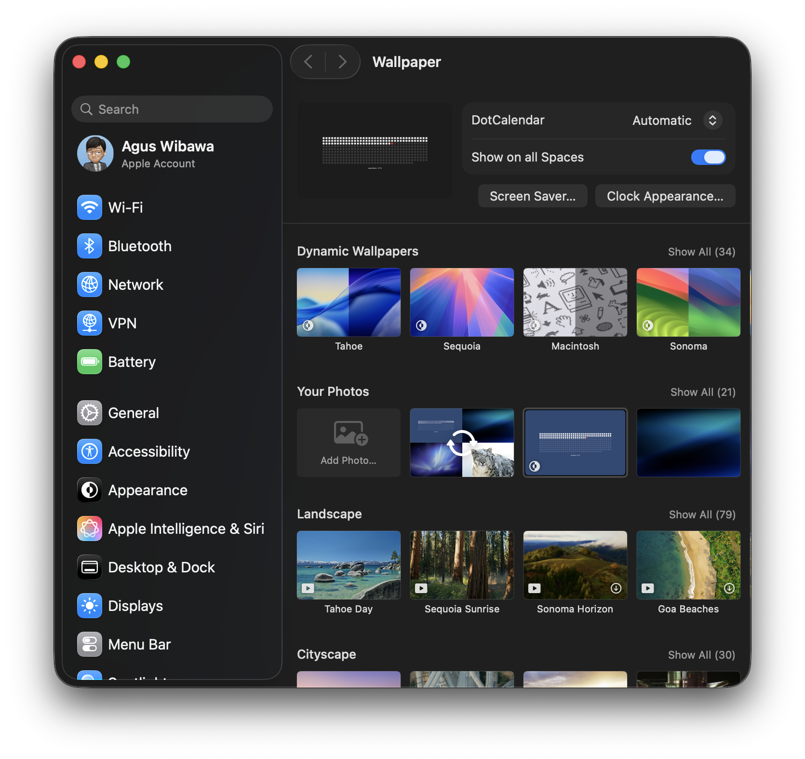
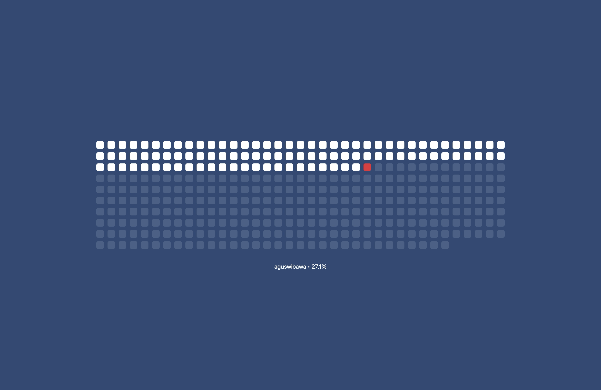
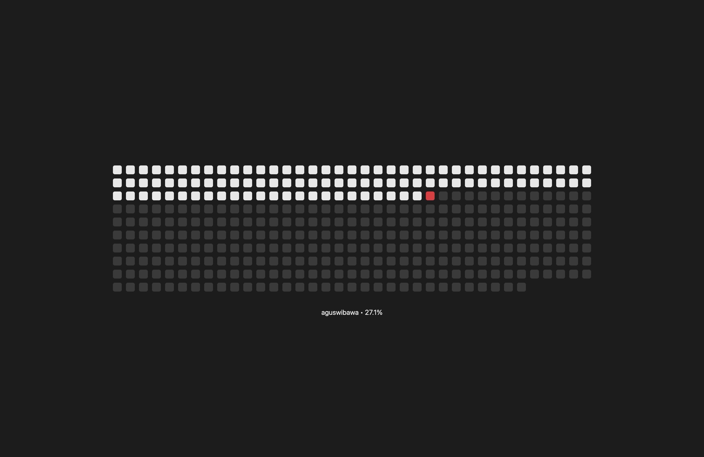
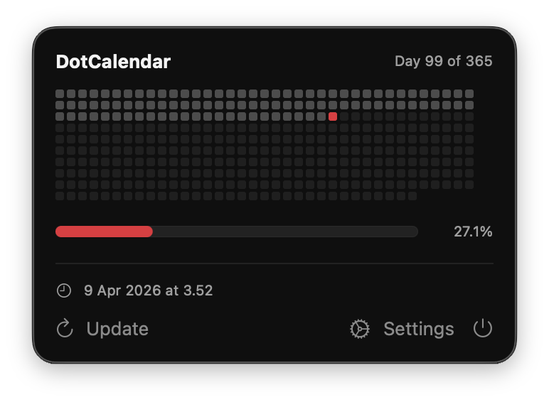
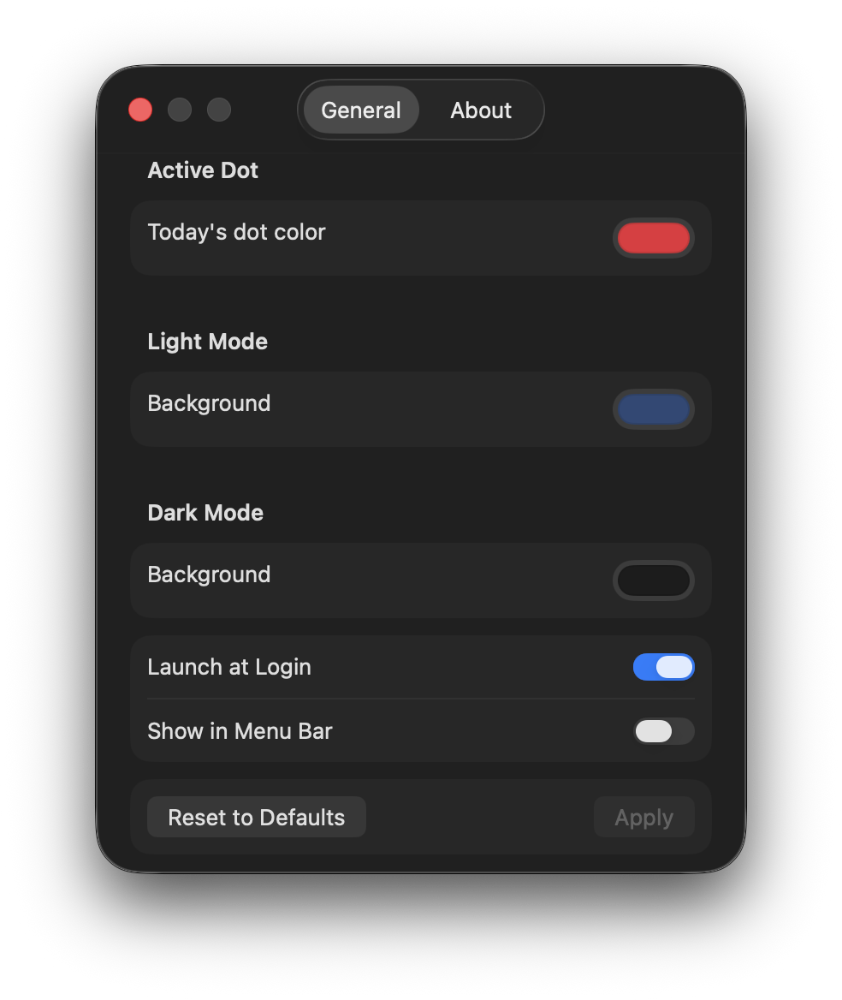

# DotCalendar

A lightweight macOS menu bar app that generates a dynamic GitHub-style dot calendar wallpaper. Each dot represents a day of the year — past days are filled, today is highlighted, and future days are dimmed. The wallpaper automatically switches between light and dark variants based on your system appearance.

  

## Features

- GitHub-style dot calendar wallpaper (37 x 10 grid, 365/366 days)
- Automatic light/dark mode switching via HEIC appearance metadata
- Menu bar icon for quick access
- Customizable colors: active dot, light background, dark background
- Auto-updates at midnight (Asia/Singapore timezone)
- Launch at Login support
- No dependencies — pure Swift, ~288KB binary

## Screenshots

### Wallpaper Preview


### Light & Dark Mode
| Light | Dark |
|-------|------|
|  |  |

### Menu Bar & Settings
| Menu Bar | Settings |
|----------|----------|
|  |  |

The wallpaper shows your macOS username and year progress percentage below the dot grid.

## Install

### From DMG

1. Download `DotCalendar.dmg` from [Releases](../../releases)
2. Open the DMG and drag **DotCalendar** to **Applications**
3. Launch from Applications

### Build from Source

Requires Xcode Command Line Tools (macOS 14+, Apple Silicon).

```bash
git clone https://github.com/wibawasuyadnya/DotCalendar.git
cd DotCalendar
chmod +x build.sh
./build.sh
```

The built app is at `build/DotCalendar.app`. A `DotCalendar.dmg` is also created in `build/`.

To install:

```bash
cp -r build/DotCalendar.app /Applications/
```

## Usage

Once launched, DotCalendar lives in your menu bar with a grid icon.

- **Update Wallpaper** — regenerate and apply immediately
- **Settings** — customize colors and enable Launch at Login
- **Quit** — stop the app

### Settings

| Setting | Description | Default |
|---------|-------------|---------|
| Active Dot | Color of today's dot | `#E8483F` (red) |
| Light Background | Wallpaper background in light mode | `#2D4976` (navy) |
| Dark Background | Wallpaper background in dark mode | `#525252` (gray) |
| Launch at Login | Start automatically on login | Off |

## How It Works

1. Calculates current day of year using Asia/Singapore timezone
2. Renders two images (light + dark) using Core Graphics
3. Packages them into a single HEIC with `apple_desktop:apr` metadata for automatic appearance switching
4. Patches macOS wallpaper store plist and restarts WallpaperAgent
5. Schedules next update at midnight

## Uninstall

Drag `DotCalendar.app` from Applications to Trash. Preferences are stored in `~/Library/Application Support/DotCalendar/` — delete that folder to remove all data.

## License

MIT
